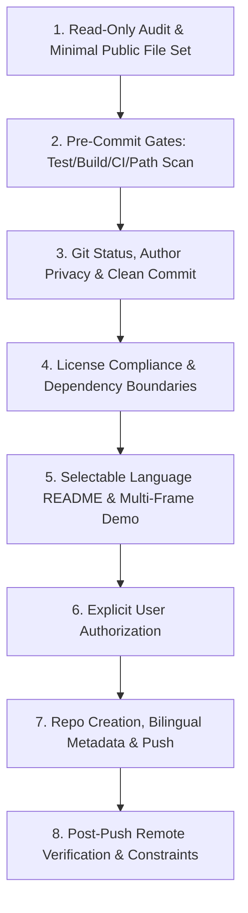

[English](README.en.md) | [中文](README.md)

# GitHub Open Source Release Skill (github-open-source-release)

[](https://github.com/divenire990/github-open-source-release-skill/actions/workflows/ci.yml)
[](LICENSE)
[](SKILL.md)
[](#project-nature-documentation-only-skill)

> **A standardized, safe, and compliant AI Agent skill specification for releasing local projects to GitHub as open-source repositories.**

Distilled from real-world open-source engineering practices, this skill is tailored for modern AI agents such as **Codex, Claude Code, and Oh My Pi**. It enforces foundational principles: read-only audit first, strict pre-commit quality gates, Git author privacy protection, explicit user authorization, zero-credential leakage, and precise open-source license boundaries.

---

## Release Workflow Demo (Offline Illustration)


> *Note: The animation above is an offline illustrative workflow diagram (`Offline workflow illustration — no live API calls`), depicting the standard 6-step release pipeline from read-only audit to remote verification.*

---

## Why This Skill?

When open-sourcing local projects to GitHub, developers and AI agents frequently encounter security, privacy, and compliance pitfalls:
- **Sensitive Data Leakage**: Hardcoded API keys, private tokens, or developer local machine paths (e.g. `C:/Users/...`) left in code or documentation.
- **Privacy Breaches**: Git commit history exposing enterprise employee IDs, internal domain emails, or personal private identifiers.
- **Accidental Artifacts**: IDE settings (`.idea`, `.vscode`), debug logs, temporary caches, test coverage, or `.env` credential files mistakenly pushed to public repositories.
- **Suboptimal User Experience**: Lack of bilingual README support, missing top-level language switcher links, broken external images, or fake single-frame GIF animations.
- **Unauthorized Actions**: AI agents creating public remotes, pushing code, or deleting repositories without explicit user authorization.

This skill eliminates these risks through **structured workflows** and a **Layered Verification Checklist**.

---

## Core Workflow Architecture



### Eight Core Specification Pillars

1. **Pre-Release Read-Only Audit & Minimal Public File Set**: Complete read-only inspection, strictly excluding IDE configurations, local logs, and secrets while ensuring comprehensive `.gitignore` rules.
2. **Pre-Commit Quality Gates**: Automated offline testing, build validation (when applicable), CI syntax verification, and deep credential/path scanning.
3. **Git Status & Author Privacy Audit**: Verifying `user.name` and `user.email` to prevent enterprise ID or private email leakage, with semantic commit formatting.
4. **License Compliance & Dependency Boundaries**: Distinguishing CLI invocations from source code distribution, adopting standard SPDX licenses (e.g., MIT/Apache-2.0).
5. **README Experience & Multi-Frame Media**: User-selected primary language with matching secondary docs, top-level language switcher, and self-contained multi-frame demo animations.
6. **GitHub Repository Creation & Explicit Authorization**: Requiring explicit user approval before performing externally visible operations; configuring bilingual descriptions and topic tags.
7. **Public Fork Cleanup & Private Reconstruction**: Clarifying platform constraints and safely recreating private repositories with confirmed two-step authorization.
8. **GITHUB_TOKEN & Keyring Privilege Handling**: Diagnosing environment variable overrides and scope deficiencies without leaking credentials.

---

## Installation & Usage

### 1. Portable Installation to Your AI Agent

Copy the core specification file `SKILL.md` (or the entire directory) into your AI agent's skill path:

```bash
# Codex global skills directory
cp SKILL.md ~/.codex/skills/github-open-source-release/SKILL.md

# Claude Code / Oh My Pi skills directory
cp SKILL.md ~/.claude/skills/github-open-source-release/SKILL.md
```

### 2. Prompting the Agent

When ready to open-source a local project, instruct your agent:

```text
Please use the github-open-source-release skill to safely and compliantly release this local project to GitHub.
```

The agent will load the specification and follow the 8-step workflow and verification checklist.

---

## Project Nature (Documentation-Only Skill)

> **Important Notice**: This repository is a **Documentation-Only Skill specification**. Its core deliverable is the standardized `SKILL.md` specification, bilingual documentation, and workflow assets.
>
> **Python packaging is not applicable** to this repository. Quality and integrity are enforced via lightweight automated offline structural validation scripts and GitHub Actions CI rather than superficial packaging artifacts.

---

## Local Structural & Security Validation

The repository includes a self-contained offline validation script covering front matter syntax, section completeness, relative media validity, animation frame counts, and secret/path scanning:

```bash
# Install lightweight validation dependencies
pip install pillow pyyaml

# Run local offline verification
python scripts/validate.py
```

---

## Contributing & Security

- **Contributing Guide**: See [CONTRIBUTING.md](CONTRIBUTING.md) for contribution rules and documentation sync standards.
- **Security Policy**: See [SECURITY.md](SECURITY.md) for security principles and vulnerability reporting instructions.

---

## License

This project is licensed under the [MIT License](LICENSE). Copyright (c) 2026 divenire990.
