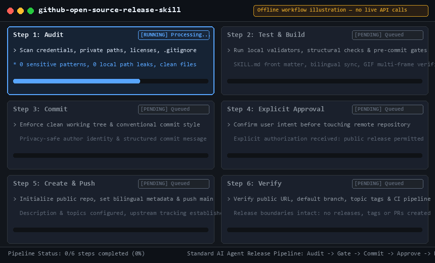
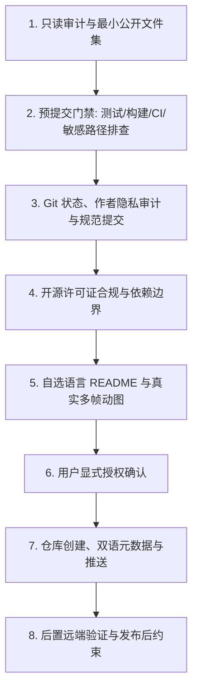

[English](README.en.md) | [中文](README.md)

# GitHub 开源项目发布规范 Skill (github-open-source-release)

[](https://github.com/divenire990/github-open-source-release-skill/actions/workflows/ci.yml)
[](LICENSE)
[](SKILL.md)
[](#项目性质声明-documentation-only-skill)

> **标准化、安全、合规地将本地项目发布为 GitHub 开源仓库的 AI Agent 技能规范。**

沉淀自真实的开源工程实践，本规范专为 **Codex / Claude Code / Oh My Pi** 等主流智能体设计，确立了只读审计优先、严格预提交门禁、Git 作者隐私保护、用户显式授权确认、敏感信息零泄漏与严谨许可证合规边界等核心原则。

---

## 核心发布工作流演示



---

## 为什么需要此技能？

将本地项目开源发布到 GitHub 时，开发者与智能体经常面临诸多潜在风险与规范缺失：
- **敏感信息外泄**：硬编码的 API Key、私有 Token、开发者本地机器绝对路径（如 `C:/Users/...`）遗留在代码或文档中。
- **隐私暴露**：Git 提交历史中残留企业内部工号、私有企业邮箱或敏感个人信息。
- **发布杂质文件**：IDE 配置（`.idea`, `.vscode`）、本地日志、缓存、测试覆盖率或 `.env` 凭据被意外推送到公开仓库。
- **体验与国际化欠缺**：README 缺少针对目标受众的双语支持、首屏互链缺失、使用失效外链图片或单帧伪造动图。
- **未授权的危险操作**：智能体在未经用户明确授权的情况下自动创建公开远端、推送代码甚至误删仓库。

本技能通过**结构化规范**与**分层验收清单（Layered Verification Checklist）**，全方位杜绝上述问题。

---

## 核心工作流与规范架构



### 八大核心规范概览

1. **发布前只读审计与最小公开文件集**：全量只读盘点，严格排除 IDE 配置、临时日志与凭据文件，确保 `.gitignore` 规则完备。
2. **预提交门禁（Pre-Commit Gates）**：执行离线自动化测试、包构建校验（如适用）、CI 语法检查与全量敏感路径/凭据扫描。
3. **Git 状态、作者隐私审计与规范提交**：核查 `user.name` 与 `user.email`，杜绝内部工号与隐私邮箱泄露，生成语义化提交。
4. **开源许可证合规与依赖边界**：严格区分 CLI 独立调用与源码复制分发，选用标准 SPDX 协议（如 MIT/Apache-2.0），规避法律风险。
5. **README 体验与自包含多媒体资产**：用户自选默认主语言（中/英），首屏双向互链，使用仓库内自包含的真实多帧演示动图。
6. **GitHub 仓库创建与显式授权**：公网可见操作（创建、推送、删除）事前必须获得用户显式确认；配置中英双语 Description 与 Topics 标签。
7. **公开 Fork 仓库的清理与私有化重建**：阐明平台限制，经二次确认后安全清理旧 Fork 并重建独立私有仓库。
8. **GITHUB_TOKEN 与 Keyring 权限安全处理**：处理子 Shell 环境变量覆盖，排查权限缺失，严禁控制台输出任何 Secret 明文。

---

## 安装与使用 (Installation & Usage)

### 1. 便携式安装到智能体

将本技能库核心规范文件 `SKILL.md`（或整个目录）复制到您正在使用的 Agent 技能目录中：

```bash
# Codex 全局 Skills 目录
cp SKILL.md ~/.codex/skills/github-open-source-release/SKILL.md

# 或 Claude Code / Oh My Pi 技能目录
cp SKILL.md ~/.claude/skills/github-open-source-release/SKILL.md
```

### 2. 在对话中调用

当您需要发布开源项目时，向智能体发出指令：

```text
请使用 github-open-source-release 技能规范，帮我将当前本地项目安全发布到 GitHub。
```

智能体将自动加载并严格遵循 8 步工作流与分层验收清单逐步执行。

---

## 项目性质声明 (Documentation-Only Skill)

> **重要说明**：本项目属于纯文档与规范型 Skill 仓库（**Documentation-Only Skill Repository**），核心资产为标准化规范说明 `SKILL.md`、多语言指南与配套演示资源。
>
> 本项目**不包含且不适用 Python 软件包构建与打包**（Python packaging is not applicable）。项目质量通过内置的离线自动化结构验证脚本与 GitHub Actions CI 进行保障，杜绝为了形式而引入虚假的 Python 打包配置。

---

## 本地结构与安全验证

项目内置了轻量化、离线运行的自动化验证脚本，覆盖 Skill YAML Front Matter、章节完整性、相对媒体引用有效性、动图真实多帧检验以及全库敏感路径/凭据排查：

```bash
# 安装验证依赖
pip install pillow pyyaml

# 执行本地结构与安全门禁验证
python scripts/validate.py
```

---

## 贡献与安全

- **贡献指南**：请阅读 [CONTRIBUTING.md](CONTRIBUTING.md) 了解技能修改准则与文档同步要求。
- **安全策略**：请阅读 [SECURITY.md](SECURITY.md) 了解敏感信息防范及漏洞报告流程。

---

## 开源许可证

本项目基于 [MIT 许可证](LICENSE) 开源。版权所有 (c) 2026 divenire990。
