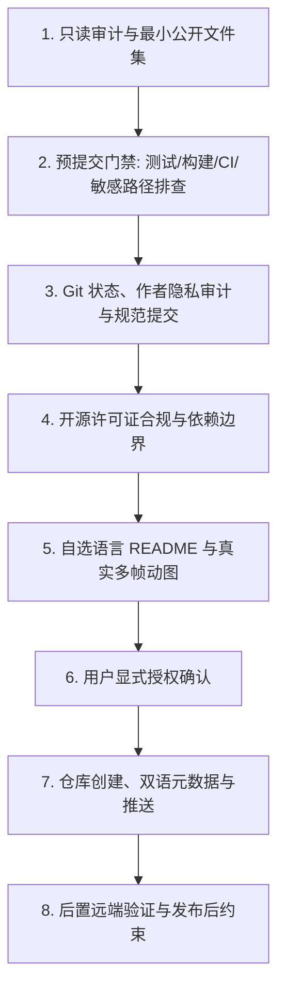

# GitHub 开源项目发布规范 (GitHub Open Source Release)

## 概述

指导并规范化将本地代码库安全、合规、高质量地发布为 GitHub 开源项目（或公开仓库）。本规范沉淀自真实开源发布实践，强调只读审计优先、严格预提交门禁、Git 作者隐私保护、显式授权确认、敏感信息零泄漏与严谨的许可证合规边界。

## 适用场景

- 将本地项目发布为 GitHub 公开开源仓库或公开代码库。
- 规范化创建 GitHub 仓库并配置 Remote、中英双语 Description 和 Topics 标签。
- 发布前的预提交质量门禁：离线自动化测试、打包构建校验（如 Python packaging）、CI 语法检查与 `.gitignore` 完备性检查。
- 开源安全审计：API Key、Token、私有内网地址、开发者本地绝对路径等敏感信息深度排查。
- Git 提交历史规范化与作者隐私（Author Name & Email）合规审计。
- 开源许可证（License）合规决策与外部 CLI/代码分发边界界定。
- README 体验优化：用户自选默认主文档语言、双语文档置顶互链、相对路径媒体资源与真实多帧演示动图（含抽帧视觉核查）。
- GitHub 公开 Fork 仓库清理与转为私有普通仓库的安全重建。
- `gh` CLI 权限排查与环境变量 `GITHUB_TOKEN` 覆盖修复。

---

## 核心工作流与规范



### 1. 发布前只读审计与最小公开文件集
- **只读审计原则**：在对代码库做出任何修改、提交或推送前，必须先进行全局只读盘点，严禁在未完整掌握代码库全貌前盲目操作。
- **最小公开文件集**：开源发布仅包含运行与构建所需的必要源码、文档、配置与静态资源。
  - **必须纳入**：核心源码、依赖声明（如 `pyproject.toml`, `package.json`, `Cargo.toml`, `requirements.txt`）、默认 `README.md`、配套语言文档（如 `README.zh-CN.md` 或 `README.en.md`）、`LICENSE`、`.gitignore`、必要的 CI 配置文件（如 `.github/workflows/`）。
  - **严禁纳入（必须被 `.gitignore` 严格忽略或在发布前清理）**：
    - 本地开发临时文件、IDE 本地工作区配置（如 `.idea/`, `.vscode/settings.json`, `.vscode/launch.json`）；
    - 调试日志、编译产物、测试中间产物及覆盖率报告（如 `tmp/`, `*.log`, `coverage/`, `.pytest_cache/`, `dist/`, `build/`）；
    - 包含凭据的环境变量与本地配置文件（如 `.env`, `.env.local`, `config.local.json`）；
    - 操作系统级临时文件（如 `.DS_Store`, `Thumbs.db`）。
- **`.gitignore` 完备性检查**：发布前必须确保项目根目录下存在契合项目技术栈的 `.gitignore` 文件，规则覆盖上述所有禁止公开文件类型。

### 2. 预提交门禁（Pre-Commit Gates）
在正式创建提交与发布前，必须在本地通过以下预提交门禁检查：

- **离线/针对性自动化测试（Automated Testing Gate）**：
  - 运行项目全量或关键路径的自动化测试（如 `pytest`, `npm test`, `cargo test`）；
  - 确保全部测试在离线或受控测试环境中通过，无未捕获异常、无断言失败、无对不可控外部网络的硬依赖导致测试中断。
- **打包构建与元数据校验（Packaging & Build Gate，如适用）**：
  - 若项目为可分发软件包或库（如 Python 包），必须在本地执行打包构建（如 `python -m build` 生成 sdist 与 wheel）；
  - 校验构建输出完整性，检查包元数据（包名、版本号、作者、依赖项声明、Entry points 等）正确无误，确保无非必要的大文件或私有资产被打包入制品。
- **CI 配置与工作流校验（CI Configuration Gate）**：
  - 若仓库包含 GitHub Actions 等 CI 配置（`.github/workflows/*.yml`），必须校验 YAML 语法结构合法性；
  - 检查 CI 触发分支（如 `main`/`master`）、运行环境 Matrix、依赖安装步骤与测试命令，确保不存在死循环逻辑或无效 Action 引用。
- **敏感路径与凭据深度排查（Credential & Path Scan Gate）**：
  - **敏感凭据扫描**：全量检索代码库中的敏感关键词，如 `api_key`, `token`, `secret`, `password`, `private_key`, `authorization`、私有证书等，杜绝任何硬编码密钥。
  - **私有环境与本地路径扫描**：全面检查代码、文档及配置中是否残留内部内网域名、内网 IP 地址、开发者本地绝对文件路径（例如 `C:/Users/...`、`/Users/...`、`D:/...`），必须统一替换为相对路径、标准环境变量或通用示例占位符。

### 3. Git 状态、作者隐私审计与规范发布提交
- **工作区状态确认**：
  - 执行 `git status`，确保当前工作区与暂存区纯净，无未被跟踪的杂质文件或意外暂存。
- **Git 作者隐私审计（Author Privacy Audit）**：
  - 执行 `git config user.name` 和 `git config user.email`，并检查现有提交历史（`git log -n 5`）；
  - 严格核实提交者姓名（Author Name）与邮箱（Author Email）符合公开开源身份规范，**严禁泄露内部工号、企业内部域名邮箱或私人敏感隐私邮箱**；若不符合，必须在提交前通过 `git config` 或相关配置纠正。
- **规范发布提交（Clear Release Commit）**：
  - 组织清晰、规范、原子化的提交信息（如 `feat: initial open source release` 或 `chore: release v1.0.0`），确保 Commit Message 语义明确，杜绝无意义的提交记录。

### 4. 许可证决策与外部依赖边界
- **许可证边界判定（风险审计规则）**：
  - **外部 CLI / 命令调用**：若项目仅通过子进程或命令行调用外部独立工具（例如通过 CLI 调用 `omp`、`ffmpeg` 等），通常可作为独立选用许可证的考量信号；但必须严格核实是否复制、修改、静态/动态链接或分发上游代码与二进制制品，以及上游许可证与使用条款的具体限制。**严禁向用户给出确定性法律结论**；存在不确定性或合规高风险时，必须明确建议用户寻求专业法律意见。同时，**严禁仅凭上游/外部工具开源就直接混入其许可证声明**。
  - **代码复制 / 分发 / 链接**：如果项目直接包含、修改或静态/动态链接了第三方开源组件的代码，必须严格遵守该第三方的开源许可证约束（如 GPL 传染性要求、保留原作者版权声明及 LICENSE 文件）。
- **LICENSE 文件生成**：
  - 选用明确的 SPDX 标准许可证（如 MIT、Apache-2.0），在仓库根目录下创建 `LICENSE` 文件，填入正确的版权年份与作者/组织名称。

### 5. README 体验与多媒体资产规范
- **默认语言用户自选（User-Selectable Default Language）**：
  - **主文档语言自选**：`README.md` 的默认语言不再假定为英文，而是由用户根据项目主要受众明确选定（例如中文为主受众时默认使用中文，国际受众为主时默认使用英文）。
  - **配套语言文档**：必须为另一受众群体提供完整的配套语言文档（如主文档为中文时提供 `README.en.md`；主文档为英文时提供 `README.zh-CN.md`）。
  - **首屏双向互链**：主文档与配套文档的首屏第一行必须放置双向语言切换互链，例如 `[English](README.en.md) | [中文](README.md)` 或 `[English](README.md) | [中文](README.zh-CN.md)`，且两份文档的章节结构、参数示例与技术术语必须保持同步。
- **真实多帧演示动图规范（Repository-Owned Multi-Frame Demo Animation）**：
  - **适用项目必须包含**：对于包含交互界面、终端 CLI 交互、MCP 工具调用或 GUI 视觉呈现的项目，推荐且要求制作高质量的演示动图（GIF/WebP/MP4）。
  - **仓库自包含与相对路径**：演示动图及所有静态图片必须存放在仓库内（如 `./assets/` 或 `./docs/images/`），并在 Markdown 中使用相对路径（如 ``），确保离线克隆、镜像站点与多分支浏览时正常加载。
  - **真实多帧与抽帧视觉审查**：演示动图必须是真实录制或真实多帧渲染的动态过程，**严禁使用单帧静态图片伪装成 GIF 动图**；必须对动图进行抽帧视觉核查，确保画面中展示的项目名称/可见标题与当前仓库完全一致、流程清晰连贯。
  - **严禁虚假/杜撰宣称**：严禁伪造 live/实时接口调用与虚假数据；对于跨平台支持（Windows/macOS/Linux）、性能基准（如 TPS、响应耗时）和内存占用等指标，必须基于真实测试数据，**严禁主观臆造或夸大宣传**。

### 6. GitHub 仓库创建、双语元数据与推送（显式授权与有序工作流）
- **操作前显式授权（Explicit Pre-Action Authorization）**：
  - 创建远端仓库（`gh repo create`）、推送分支（`git push`）以及删除远端仓库均涉及公网外部可见的副作用。
  - **在执行任何对外可见操作前，必须向用户清晰列出目标仓库名、所属 Owner/组织、公开性（Public/Private），并在获得用户明确授权后方可执行**。
- **gh CLI 状态与环境排查**：
  - 执行 `gh auth status` 确认当前登录账号、所属 Host 及具备的 OAuth/Token 权限范围。
  - 检查目标仓库名是否已存在（`gh repo view <owner>/<repo>`），避免命名冲突或意外覆盖。
- **仓库创建与双语元数据配置（Bilingual Description & Topics）**：
  - 创建公开仓库（`gh repo create <repo> --public ...`）；
  - **双语 Description 规范**：当项目面向中英双语受众时，GitHub 仓库 Description **必须配置为中英双语形式**（例如：`中文一句话简介｜English concise summary`），兼顾国内外开发者检索与浏览体验；
  - **Topics 标签**：必须配置准确、丰富的 `topics` 标签（如 `mcp`, `python`, `academic`, `scholar` 等），提升项目的可发现性与索引质量。
- **分支推送与后置远端验证（Post-Push Remote Verification）**：
  - 执行推送命令（`git push -u origin <branch>`）；
  - **推送后验证**：推送完成后，必须通过 `gh repo view <owner>/<repo>` 或网页检查，验证远端仓库 URL、公开性状态（Public/Private）、Description 与 Topics 展示无误、默认分支与源码完整呈现、README 首屏渲染正常。

### 7. 公开 Fork 仓库的清理与私有化重建
- **平台限制声明**：
  - GitHub 平台限制：**公开 Fork（Public Fork）仓库无法直接通过设置或 API 修改为私有（Private）**。
- **清理与重建流程**：
  - 若用户需要将公开 Fork 转换为私有普通仓库，必须向用户清晰说明该平台限制与操作影响。
  - **删除旧仓库为高危破坏性操作，必须获得用户的显式、二次确认授权**。
  - 标准流程：
    1. 确保本地拥有完整的最新代码与提交；
    2. 获得明确授权后删除原公开 Fork 仓库（`gh repo delete <owner>/<repo> --yes`）；
    3. 创建全新的独立普通私有仓库（`gh repo create <repo> --private`）；
    4. 重新关联远程地址并推送到新仓库。

### 8. GITHUB_TOKEN 覆盖与 Keyring 权限安全处理
- **凭据覆盖机制**：
  - 当环境中注入了 `GITHUB_TOKEN` 环境变量时，`gh` CLI 会优先使用该环境变量，从而忽略本地安全存储（Keyring）中已授权完整权限（如 `delete_repo`, `repo`, `workflow`）的登录凭据。
- **权限不足排查**：
  - 若遇到权限不足（如执行删除或管理操作报 403 / 缺少 scope），应提示用户排查环境变量中的 `GITHUB_TOKEN` 是否覆盖了 keyring 登录态。
  - 引导用户在当前子 shell 进程中临时取消该环境变量（明确仅影响当前 shell，例如在 Windows PowerShell 中使用 `Remove-Item Env:GITHUB_TOKEN` 或 `$env:GITHUB_TOKEN=$null`，在 Bash 中使用 `unset GITHUB_TOKEN`），或为 Token 补充相应 Scope。排查与清理全过程严禁输出令牌明文。
- **安全红线**：
  - **严禁在控制台输出、日志记录或向用户回复中打印任何 GitHub Token、Secret 或密码明文！**

### 9. 发布后动作约束
- **严禁自动创建衍生对象**：
  - 当仓库创建与代码推送完成后，**严禁自动创建 Release、Tag、Issue 或 Pull Request**，除非用户在当前对话中明确下达对应指令。
  - 保持发布流程干净专注，将版本 Release 发布说明与 Tag 标记控制权完全交还给用户。

---

## 常用命令模板（执行前务必确认目标参数）

> **注意**：以下命令包含占位符 `<owner>`、`<repo>`、`<branch>` 等，在实际执行前必须核实目标参数，且涉及远端创建、修改或删除的命令必须先取得用户显式授权。

```bash
# 1. 运行本地自动化测试与打包构建检查（预提交门禁）
pytest
python -m build

# 2. 检查 Git 工作区状态与提交者身份
git status
git log -n 5 --pretty=format:"%h - %an <%ae> : %s"

# 3. 检查 gh 登录身份与权限
gh auth status

# 4. 检查目标仓库是否已存在
gh repo view <owner>/<repo>

# 5. 创建公开开源仓库并设置双语描述与主题（需用户明确授权）
gh repo create <repo> --public --description "中文简介｜English summary" --source=. --remote=origin

# 6. 配置仓库 Topics 标签
gh repo edit <owner>/<repo> --add-topic topic1 --add-topic topic2

# 7. 推送代码到远端（需用户明确授权）
git push -u origin <branch>

# 8. 推送后远端状态验证
gh repo view <owner>/<repo> --json name,description,isPrivate,url,defaultBranchRef

# 9. 删除仓库（高危操作，必须获得用户明确二次确认授权）
gh repo delete <owner>/<repo> --yes
```

---

## 分层验收清单 (Layered Verification Checklist)

在宣布开源发布完成前，必须按以下层级逐项自检并确认：

- [ ] **第 1 层：预提交门禁与敏感信息验收**
  - [ ] 离线/针对性自动化测试全部通过，无断言失败或外部网络中断；
  - [ ] 软件包构建（Packaging Build）成功，元数据完整（如适用）；
  - [ ] CI 配置文件（如 GitHub Actions YAML）语法校验通过；
  - [ ] `.gitignore` 规则完备，排除所有临时文件、本地 IDE 配置、编译中间产物、日志及 `.env` 凭据文件；
  - [ ] 全文敏感信息扫描无 API Key、密码、Token、私有凭据；
  - [ ] 全文排查无内部内网 IP/域名及开发者本地绝对路径（如 `C:/Users/...`）。
- [ ] **第 2 层：Git 状态、作者隐私与规范提交验收**
  - [ ] `git status` 确认工作区与暂存区纯净；
  - [ ] Git 作者名（Author Name）与邮箱（Author Email）无隐私泄露与内部工号；
  - [ ] Release Commit 信息规范清晰、语义明确。
- [ ] **第 3 层：许可证与合规验收**
  - [ ] 项目根目录下存在标准的 `LICENSE` 文件（SPDX 标准）；
  - [ ] 明确界定外部 CLI 依赖调用与源码复制/分发边界，无许可证混淆与合规风险。
- [ ] **第 4 层：README 与真实多媒体验收**
  - [ ] `README.md` 默认主语言由用户明确选定，并配套另一语言完整文档；
  - [ ] 首屏置顶双向语言切换互链（结构与术语保持同步）；
  - [ ] 媒体资源使用仓库自包含的相对路径引用；
  - [ ] 演示动图为真实多帧连续捕获，经抽帧视觉核查确认画面标题与项目一致，无静态伪装动图；
  - [ ] 无杜撰或夸大的跨平台/性能/实时接口虚假宣称。
- [ ] **第 5 层：GitHub 授权、双语元数据与发布后验收**
  - [ ] 仓库创建、推送或删除操作已获得用户事前明确授权；
  - [ ] 面向双语受众时，GitHub Repository Description 已配置为中英双语格式；
  - [ ] 仓库 Topics 标签精准完整；
  - [ ] 分支代码推送成功，并通过 `gh repo view` 完成后置远端状态验证；
  - [ ] 遇到 Token/Keyring 权限异常时排查合规，无 Token 明文泄露；
  - [ ] 发布完成后未自动创建非指令的 Release、Tag、Issue 或 Pull Request。
